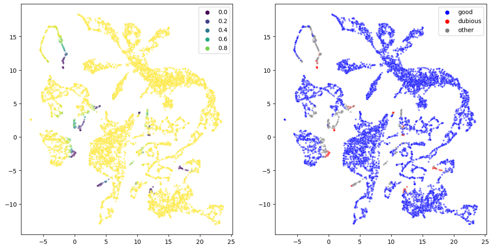

This code proposes a python implementation of the method originally described in:

["scDEED: a statistical method for detecting dubious 2D single-cell embeddings "
Lucy Xia, Christy Lee, and Jingyi Jessica Li](https://www.biorxiv.org/content/10.1101/2023.04.21.537839v1.full)

The original R implementation can be found in their [github repo](https://github.com/JSB-UCLA/scDEED/)

Demo of the method in `scDEED_python_demo.ipynb`

Defined functions in `scDEED.py`
